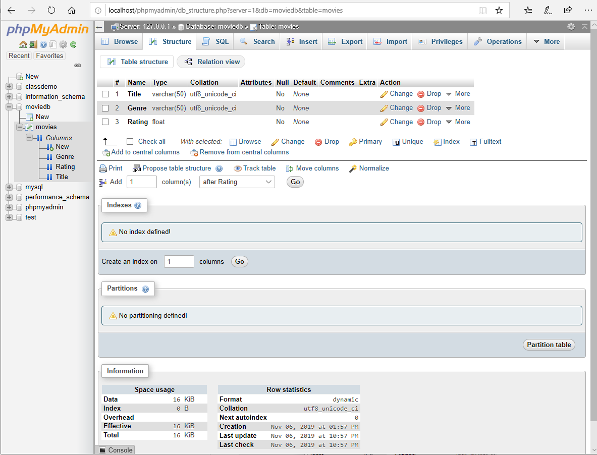

### Open phpMyAdmin tab from [xampp dashboard](http://localhost/dashboard)

### Will be greeted with a dashboard like the following

### Hit `New` to create a new DB called `movieDB`

### Name the new DB `movieDB` and select the collation as `utf8_unicode_ci` which would work for most cases

### There will be new table creation page which will be presented

### Give the table `movies` name and have just `3` columns for `title`, `genre` and `rating`

### Create the necessary fields to store the data which we intend to

### DB setup with the table and fields needed should now be completed

